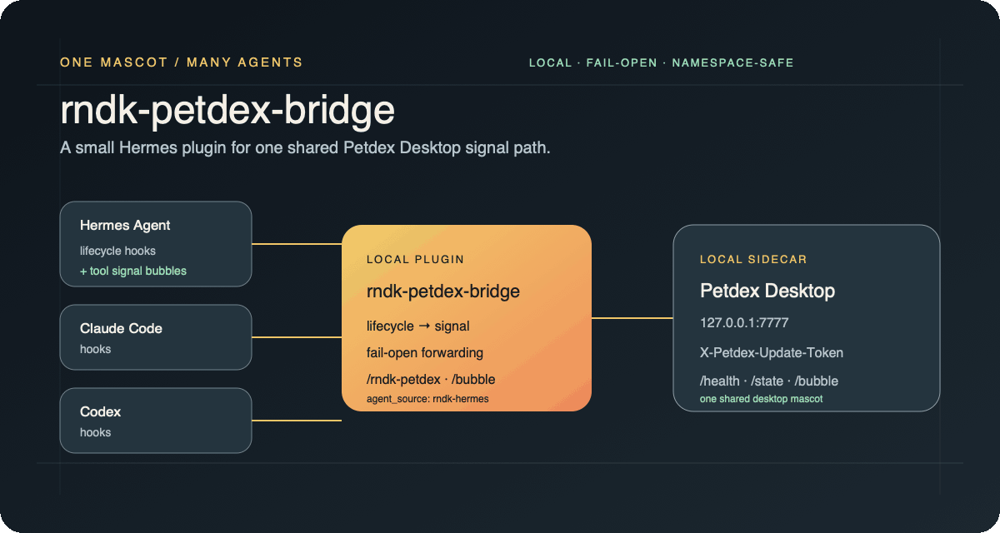
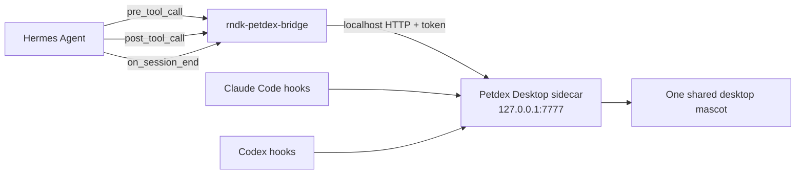

# rndk-petdex-bridge

[](https://github.com/irandoku/rndk-petdex-bridge/actions/workflows/test.yml)
[](LICENSE)

> One shared Petdex Desktop mascot for Hermes, Claude Code, and Codex.

<picture>
  <source media="(prefers-reduced-motion: reduce)" srcset="assets/readme/hero.svg" />
  
</picture>

Static SVG fallback: [`assets/readme/hero.svg`](assets/readme/hero.svg) · Motion spec: [`assets/readme/hero-motion.json`](assets/readme/hero-motion.json)

A small, unofficial [Hermes Agent](https://github.com/NousResearch/hermes-agent) plugin that forwards Hermes lifecycle events to one shared [Petdex Desktop](https://github.com/crafter-station/petdex) mascot.

The goal is one external desktop pet that can react to multiple agents such as Claude Code, Codex, and Hermes. This repository does **not** patch or fork either upstream project.

## Namespace separation

Hermes already includes its own Petdex-based mascot for the Hermes CLI, TUI, and desktop interface. This bridge deliberately uses a separate namespace:

| Item | Name |
| --- | --- |
| Repository | `rndk-petdex-bridge` |
| Hermes plugin | `rndk-petdex-bridge` |
| Hermes command | `/rndk-petdex` |
| Petdex `agent_source` | `rndk-hermes` |

It does not replace or modify Hermes' built-in `/petdex`, `hermes pets`, `display.pet`, or `~/.hermes/pets/` features.

## Architecture



The bridge turns real agent lifecycle hooks into short Petdex signals:

| Hermes event | Petdex state |
| --- | --- |
| `on_session_start` | `jumping` for 0.8 seconds + `Thinking…` bubble |
| `pre_tool_call` | `running`, or `review` for read-only inspection tools |
| `post_tool_call` | `idle`, or `failed` for an unsuccessful tool call |
| `on_session_end` | `waving` for 1.6 seconds + `Done.` bubble |

Tool lifecycle messages use the sidecar's `/bubble` endpoint, clipped to 200 characters. Every state and bubble carries `agent_source: rndk-hermes`, keeping this bridge separate from Hermes' built-in Petdex integration.

## Requirements

- Hermes Agent with plugin hooks and plugin slash commands (tested with `0.18.2`).
- Petdex Desktop and its local sidecar (tested with Petdex `0.4.4`).
- Petdex Desktop running on `127.0.0.1:7777`.
- `~/.petdex/runtime/update-token` created by the Petdex sidecar.

No Python package dependency is required; runtime code uses only the standard library.

## Install

```bash
hermes plugins install irandoku/rndk-petdex-bridge --enable
```

Restart the active Hermes process after installation. For the gateway:

```bash
hermes gateway restart
```

Verify discovery:

```bash
hermes plugins list
```

Then run inside a Hermes session:

```text
/rndk-petdex status
/rndk-petdex ping
/rndk-petdex idle
```

## Command reference

| Command | Effect |
| --- | --- |
| `/rndk-petdex` | Same as `status` |
| `/rndk-petdex status` | Show sidecar, token, kill-switch, state, and source status |
| `/rndk-petdex ping` | Send `waving` for 1.6 seconds |
| `/rndk-petdex idle` | Send `idle` |

The command accepts only these fixed subcommands. It does not execute shell input.

## Failure and safety behavior

- Communication is restricted by default to `http://127.0.0.1:7777`.
- The update token is read from `~/.petdex/runtime/update-token`, sent only as the `X-Petdex-Update-Token` header, and never included in diagnostics.
- `~/.petdex/runtime/hooks-disabled` is respected. When present, both lifecycle notifications and manual `ping`/`idle` commands are skipped.
- Missing token, stopped sidecar, timeouts, malformed responses, and HTTP errors fail open: Hermes continues normally.
- The bridge adds no telemetry. Petdex Desktop's own telemetry policy remains independent.
- No Hermes or Petdex upstream files are modified.

## Disable or remove

Disable without uninstalling:

```bash
hermes plugins disable rndk-petdex-bridge
```

Remove:

```bash
hermes plugins remove rndk-petdex-bridge
```

Restart Hermes after either operation.

## Development

```bash
python3 -m pip install pytest
python3 -m pytest -q
```

Tests use an in-process loopback HTTP server; they do not contact a real Petdex Desktop instance or read the user's token.

## Compatibility note

This project intentionally targets the local Petdex Desktop sidecar contract used by Petdex `0.4.4` (`/health`, `/state`, and the update-token header). If Petdex changes this private/local contract, the bridge may need a compatibility update.

## License

MIT. See [LICENSE](LICENSE).
